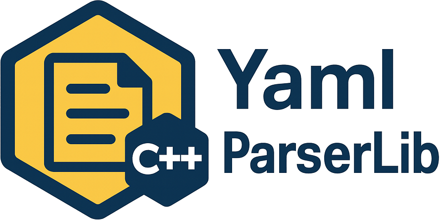

### Hi, I am Hamid! Great to see you here! 

### 👨🏻‍💻 &nbsp;About Me

👨‍💻&nbsp; I'm a Senior Software Developer and Researcher, holding a PhD in Computer Science. \
🏢&nbsp; Currently, I’m working at Synaptics.\
🎓&nbsp; I earned my degree from FEUP – Faculdade de Engenharia da Universidade do Porto.\
🎬&nbsp; In my spare time, I enjoy walking and watching movies, especially anime.\
📬&nbsp; You can reach me at hamid.arabnejad@gmail.com. I’ll get back to you as soon as I can!\
🔗&nbsp; Check out my [LinkedIn](https://www.linkedin.com/in/hamid-arabnejad/) for more about my experience and background.

### 🛠&nbsp;Tech Stack
<!--  -->

### 📚&nbsp;Academic Publications
You can find my research papers and academic contributions on [Google Scholar](https://scholar.google.co.uk/citations?user=kicg104AAAAJ&hl=en).

### 📫&nbsp; How to reach me:
 &nbsp;
 &nbsp;

### ✨ Personal Projects

#### [YamlParser](https://github.com/arabnejad/yamlparser)

  Modern C++14 YAML parser library with no third-party dependencies, robust exception-based error handling, and YAML 1.2 support. Implements RAII design, smart pointer management, and exception-safe resource handling for memory safety. Includes CMake-based build, GoogleTest integration, code coverage tools, code style enforcement (clang-format), and real-world usage examples for easy integration and maintainability.

#### [TickTrakr - Issue/Task Management System](https://github.com/arabnejad/TickTrakr)

  Designed and implemented a modular IT support and ticket management system using Python FastAPI microservices architecture. The system features role-based access control (Admin, Developer, IT), real-time event tracking via MQTT, and stateless authentication using JWT tokens. Built with modern technologies including PostgreSQL for data persistence, Redis for session management, and Docker Compose for orchestration. The frontend utilizes Jinja2 templates for role-specific dashboards, while the backend comprises independent services for authentication, user management, and ticket handling. Implemented comprehensive logging, health checks, and service dependencies to ensure system reliability and maintainability.

#### [CppColorLog - Colorful C++ Logger](https://github.com/arabnejad/cppColorLog)

  CppColorLog is a lightweight, header-only C++ logging library I designed and implemented to provide color-coded, context-aware logging with minimal integration overhead. It supports multiple output sinks (console, file, in-memory), ANSI terminal coloring, log level filtering, customizable formats, and scoped configuration through push/pop settings. Built with thread-safety and performance in mind, it requires only C++11 and integrates easily with CMake. The project includes a comprehensive unit test suite (GoogleTest) and a full suite of usage examples to demonstrate real-world integration patterns.
